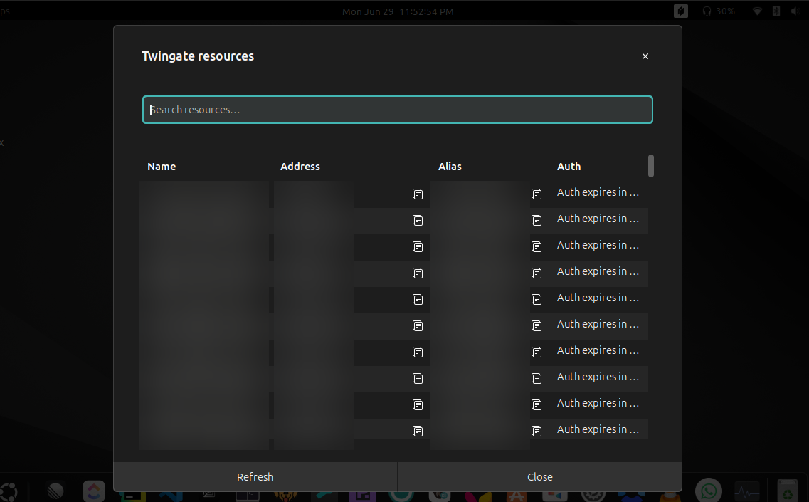

# Twingate for GNOME

A GNOME Shell extension that puts a Twingate status icon in the top bar. The
icon reflects your VPN connection state, and the menu lets you connect, pause,
browse and re-authenticate your resources, switch exit nodes and accounts, and
control the Twingate daemon — all driven through the `twingate` CLI.



## Requirements

- **GNOME Shell 46.**
- **Twingate for Linux** installed, with the `twingate` CLI on your `PATH`.

The extension shells out to the `twingate` CLI for everything — it does not talk
to any D-Bus/systemd API. If a command fails when you run it manually in a
terminal, it will fail in the extension too.

## Installation

### From source (local install)

```bash
git clone git@github.com:mhsiddiqui/twingate-gnome.git
cd twingate-gnome
./install.sh
gnome-extensions enable twingate-gnome@mhsiddiqui.github.io
```

Then restart GNOME Shell so it picks up the new extension:

- **X11:** press `Alt`+`F2`, type `r`, press `Enter`.
- **Wayland:** log out and back in (there is no in-session reload on Wayland).

`install.sh` copies the source into
`~/.local/share/gnome-shell/extensions/twingate-gnome@mhsiddiqui.github.io/`. There is no build
step — the source files are the shipped artifact.

### Uninstall

```bash
gnome-extensions disable twingate-gnome@mhsiddiqui.github.io
rm -rf ~/.local/share/gnome-shell/extensions/twingate-gnome@mhsiddiqui.github.io
```

## The menu

The panel button opens a menu with:

| Item | What it does |
| --- | --- |
| **Status** | Current connection state (`online` / `offline`). |
| **Connect / Disconnect** | Full connect/disconnect — runs `twingate start` + `desktop-start` / `twingate stop` + `desktop-stop`. Label flips with state. |
| **Pause / Reconnect** | Pause keeping your tokens — `twingate disconnect` / `twingate connect`. |
| **Resources…** | Opens a searchable modal listing every authorized resource (see below). Enabled only while connected. |
| **Exit node…** | Modal to route all traffic through Twingate, stop routing, or switch to a listed exit node. Enabled only while connected. |
| **Account…** | Modal to switch between accounts or log out. |
| **Service ▸** | Submenu: Start / Stop the Twingate daemon (`twingate service-start` / `service-stop`). |
| **Notifications ▸** | Submenu: Start / Stop / Restart the desktop notifier (`twingate desktop-start` / `desktop-stop` / `desktop-restart`). |
| **(version line)** | Shows `twingate version`. |
| **Collect diagnostics** | Runs `twingate report` and surfaces the result as a notification. |

### Resources modal

The **Resources…** item opens a modal with a search box and a table of your
resources — **Name**, **Address**, **Alias**, and **Auth** columns:

- **Search** filters by name, address, or alias as you type. Pressing `Enter`
  authenticates the first match.
- **Click a resource name** to run `twingate auth <name>` (opens your browser to
  re-authenticate it).
- **Copy buttons** on the Address and Alias cells copy the value to the
  clipboard.

The list is prefetched when you open the panel menu so the modal opens instantly,
and a **Refresh** button re-runs the query on demand.

## Connection-state detection

Twingate doesn't expose a queryable connection API for the desktop, so the
extension derives state by polling for the daemon's auth socket at
`/run/twingate/auth.sock`. It watches on a slow (10 s) cadence in steady state
and briefly speeds up to 1 s right after you start/stop the connection so the UI
catches up quickly.

## Commands used

The extension only ever invokes the following `twingate` subcommands:

```
twingate version
twingate start | stop
twingate connect | disconnect
twingate desktop-start | desktop-stop | desktop-restart
twingate service-start | service-stop
twingate -d resources
twingate auth <resource-name>
twingate exit-node start | stop | list | switch <name>
twingate account list | switch <name> | logout
twingate report
```

Interactive/admin subcommands (`setup`, `config`, `account add`, `kube`, `ssh`)
are intentionally excluded — they need a terminal, arguments, or a browser flow
and can't work as fire-and-forget menu clicks.

## Development

```bash
# Reinstall after editing
./install.sh

# Tail the extension's logs
journalctl /usr/bin/gnome-shell -f -o cat

# Lint (ESLint 9 flat config)
npx eslint extension.js
```

`@girs/gjs` and `@girs/gnome-shell` are dev dependencies that provide type and
IntelliSense information for editors only — they are not bundled into the
extension.

You can iterate without logging out by running a **nested** GNOME Shell:

```bash
export MUTTER_DEBUG_DUMMY_MODE_SPECS=1920x1080
dbus-run-session -- gnome-shell --nested --wayland
```

> **Note:** `PopupSubMenuMenuItem` submenus (Service / Notifications) do not
> expand inside a nested shell — that's a known quirk of the nested compositor,
> not a bug in the extension. They work normally in a real logged-in session.

## License

GPL-3.0-or-later. See [LICENSE](LICENSE).
